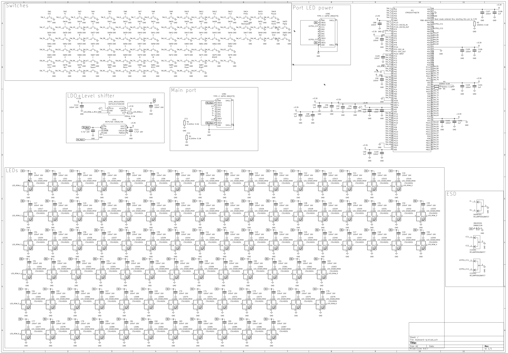
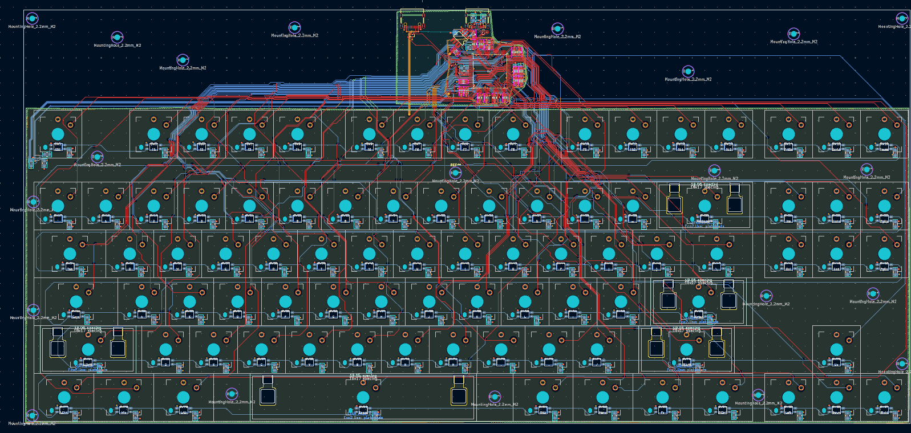
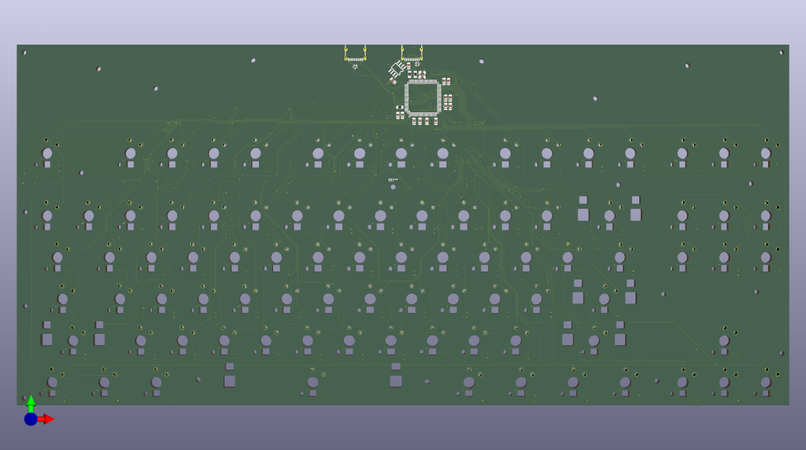
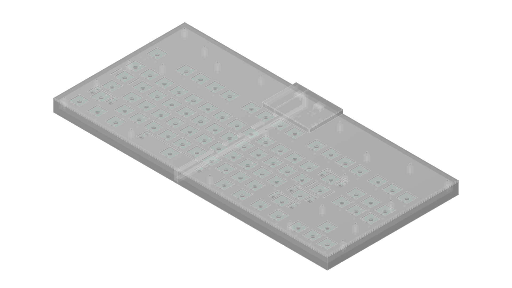
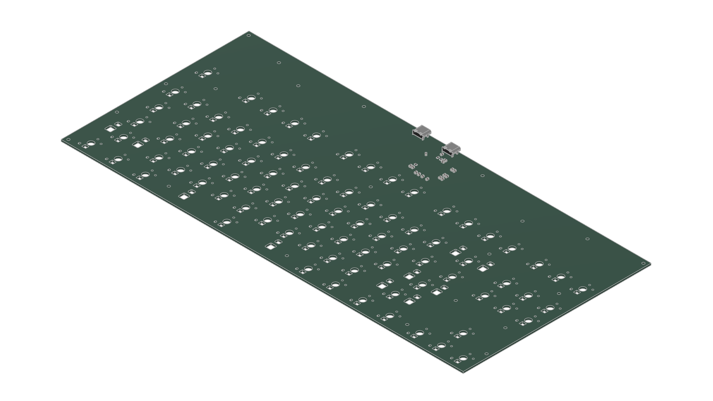
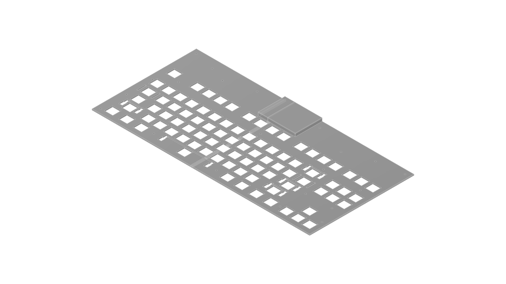
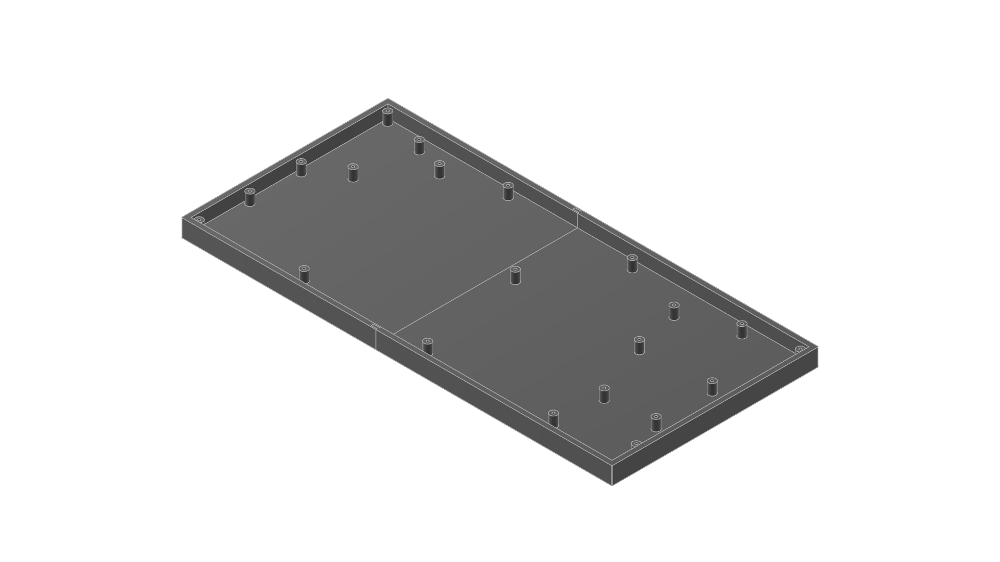

# keyboard-lp

## Description

It is my first low-profile keyboard, and first per-key GPIO keyboard. It features 2 USB ports - one for communication with PC and one for power for LEDs, per-key LED backlight and full n-key rollover!

## Why i made this project

I like making keyboards, it is my second keyboard i designed and it is very fun. I also want to use LP keyboard, but i dont have budget to buy ready-to-use one.

# Photos

# BOM

|Product                            |Description                    |Price   |Shipping                               |Amount      |Why more than needed               |Link                                              |
|-----------------------------------|-------------------------------|--------|---------------------------------------|------------|-----------------------------------|--------------------------------------------------|
|Kalih Choc v2                      |Switches                       |27.72USD|Free                                   |90          |Nearest amount more to 87 needed   |https://aliexpress.com/item/1005008175864256.html |
|Keycaps                            |Keycaps                        |14.89USD|Free                                   |118         |Its full set, cheapest I could find|https://aliexpress.com/item/1005004613625285.html |
|Stabs                              |Stabilizers                    |6.10USD |Free                                   |1x6.25u 4x2u|N/A                                |https://aliexpress.com/item/1005009331747192.html |
|TORCH C0805B104K500NT              |Decoup caps                    |0.43USD |LCSC                                   |125         |Sold in batches of 25, need 101    |https://www.lcsc.com/product-detail/C476766.html  |
|Taiyo Yuden HMK212BC7105KGHTE      |Bigger decoup caps             |0.43USD |LCSC                                   |10          |Sold in batches of 10, need 9      |https://www.lcsc.com/product-detail/C385977.html  |
|KEMET C0805C473J3GECTU             |Bulk decoup caps               |1.04USD |LCSC                                   |5           |Sold in batches of 5, need 2       |https://www.lcsc.com/product-detail/C22409503.html|
|TECH PUBLIC RCLAMP0502BATCT        |ESD diode for CC and Data lanes|0.48USD |LCSC                                   |10          |Sold in batches of 10, need 3      |https://www.lcsc.com/product-detail/C3040620.html |
|TI SN74LVC1T45DCKR                 |Level shifter                  |0.45USD |LCSC                                   |5           |Sold in batches of 5, need 1       |https://www.lcsc.com/product-detail/C9382.html    |
|SHOU HAN TYPE-C 16PIN 2MD(073)     |USB-C ports                    |1.23USD |LCSC                                   |20          |Sold in batches of 20, need 2      |https://www.lcsc.com/product-detail/C2765186.html |
|MICROCHIP MCP1726-3302E/SN         |LDO                            |2.22USD |LCSC                                   |1           |N/A                                |https://www.lcsc.com/product-detail/C635928.html  |
|OPSCO Optoelectronics SK6812MINI-YW|LED Diodes                     |14.85USD|LCSC                                   |90          |Sold in batches of 5, need 87      |https://www.lcsc.com/product-detail/C5378722.html |
|Littelfuse SMA6L5.0A               |VBUS ESD diodes                |1.57USD |LCSC                                   |2           |N/A                                |https://www.lcsc.com/product-detail/C1974860.html |
|FOJAN FRC0805J220 TS               |Data lanes resistors           |0.17USD |LCSC                                   |100         |Sold in batches of 100, need 2     |https://www.lcsc.com/product-detail/C2907310.html |
|FOJAN FRC0805J330 TS               |Level shifter→LEDs resistor    |0.17USD |LCSC                                   |100         |Sold in batches of 100, need 1     |https://www.lcsc.com/product-detail/C2907322.html |
|FOJAN FRC0805J103TS                |Boot pin pulldown resistor     |0.18USD |LCSC                                   |100         |Sold in batches of 100, need 1     |https://www.lcsc.com/product-detail/C2930231.html |
|FOJAN FRC0805J512TS                |CC resistors                   |0.17USD |LCSC                                   |100         |Sold in batches of 100, need 2     |https://www.lcsc.com/product-detail/C2930296.html |
|ST STM32G474QCT6                   |MCU                            |7.30USD |LCSC  (5.07USD for all items from LCSC)|1x6.25u 4x2u|N/A                                |https://www.lcsc.com/product-detail/C730128.html  |
|PCB from JLCPCB                    |PCB                            |54.40USD|19.14USD                               |5           |Minimal order is 5                 |https://www.jlcpcb.com                            |
|Screws                             |M2x12 flathead screws          |1.48USD |Free                                   |50          |Minimal order is 50                |https://aliexpress.com/item/1005007593731439.html |
|Total                              |97.79USD                       |74.58USD|25.21USD                               |            |                                   |                                                  |
